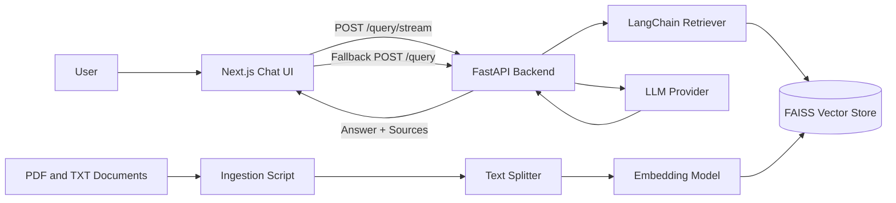
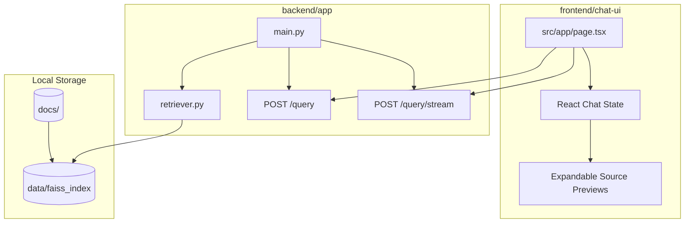
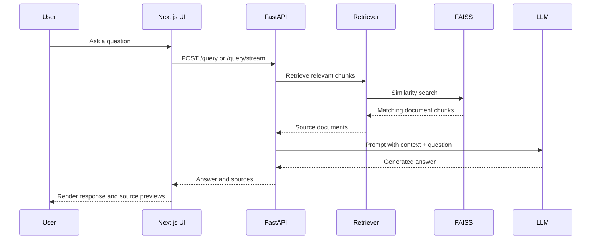
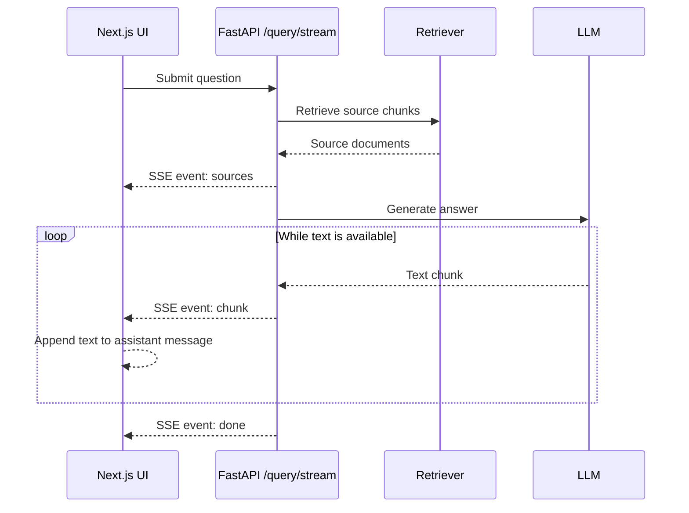
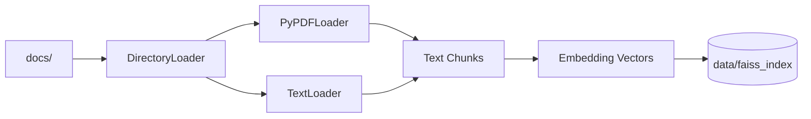

# Knowledge Base Assistant Design

## Overview

Knowledge Base Assistant is a local retrieval-augmented generation application. It indexes PDF and text documents into a FAISS vector store, retrieves relevant document chunks for a user question, and generates a grounded answer through a chatbot UI.

The project is split into two applications:

- `backend/app`: FastAPI service for document retrieval and answer generation.
- `frontend/chat-ui`: Next.js chat interface for asking questions and viewing cited sources.

## System Architecture



## Runtime Components



## Goals

- Let users ask natural language questions about indexed documents.
- Return answers grounded in retrieved document context.
- Show source citations and previews so users can inspect where answers came from.
- Support streaming responses when the configured LLM supports it.
- Keep a non-streaming fallback path for compatibility.

## Backend Design

The backend exposes two query endpoints:

- `POST /query`: returns a complete answer and source list in one JSON response.
- `POST /query/stream`: returns Server-Sent Events with source metadata first, then answer chunks.

At startup, the backend loads:

- Embeddings provider.
- FAISS vector store from `data/faiss_index`.
- Retriever configured with `TOP_K`.
- LLM provider.

Provider selection is environment-based:

- If `OPENAI_API_KEY` is set, OpenAI embeddings and chat models are used.
- Otherwise, Hugging Face embeddings and `google/flan-t5-base` are used locally.

The Hugging Face fallback runs on CPU with truncation and a bounded output length to avoid local Mac MPS runtime issues.

## Retrieval Flow



1. User submits a query from the frontend.
2. Backend retrieves the most relevant document chunks from FAISS.
3. Retrieved chunks are formatted into the RAG prompt.
4. The LLM generates an answer using only the provided context.
5. The backend returns the answer with source metadata.

For PDF files, source metadata includes a page number when provided by the document loader.

## Streaming Flow



The streaming endpoint uses Server-Sent Events:

- `sources`: sent first with source filenames, page numbers, and text previews.
- `chunk`: sent repeatedly as answer text becomes available.
- `done`: sent when generation completes.

When OpenAI is configured, answer text streams from the model. When the local Hugging Face fallback is used, the backend generates the full answer and emits it in word-sized chunks so the frontend can use the same rendering path.

## Frontend Design

The frontend is a single-page chat UI built with Next.js and React state.

User interaction flow:

1. User enters a question and clicks Send or presses Enter.
2. The UI immediately adds the user message and an empty assistant message.
3. The UI calls `POST /query/stream`.
4. Source previews appear as soon as the backend sends them.
5. Assistant answer text is appended as chunks arrive.

If `/query/stream` is unavailable, the frontend falls back to `POST /query` so older backend instances can still answer.

Sources are displayed as expandable sections containing:

- Source file path.
- Page number when available.
- Retrieved text preview.

## Data Storage



The generated FAISS index is stored locally at:

```text
data/faiss_index
```

This is treated as generated runtime data and is ignored by Git. To rebuild it, run the ingestion script against a documents directory.

## Current Limitations

- The backend initializes the RAG pipeline at import time, so startup can be slow.
- Local Hugging Face generation is slower than OpenAI-backed generation.
- The frontend currently points directly to `http://127.0.0.1:8000`.
- CORS is open for local development and should be restricted before production use.
- There is no authentication or authorization layer.
- There is no automated evaluation pipeline yet.

## Future Improvements

- Move backend model/vector initialization into FastAPI startup lifecycle hooks.
- Add environment-based frontend API configuration.
- Add document upload and re-ingestion workflows.
- Add automated retrieval and answer quality evaluations.
- Add stricter guardrails for unsupported or out-of-scope questions.
- Add tests for both `/query` and `/query/stream`.
